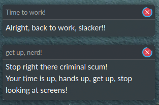
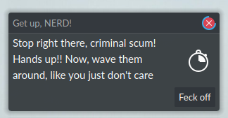
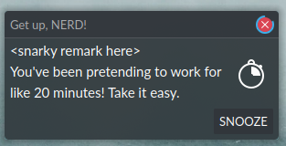

+++
title="How systemd saved me from tendinitis or how to use systemd timer in Nix (also Rust)"
date=2021-09-10

[taxonomies]
categories = ["Post"]
tags = ["post", "rust", "systemd", "nix", "linux", "sillyprograms"]

[extra]
comments = false
toc = true
+++

<center> <h1>🏗 We be Wipping 🏗</h1> </center>


___


> « Sir, you have tendinitis, also CTS. »
>
> -- <cite>Your Doc</cite>

> « But Doc, I don't understand, I am an healthy 24 years old. I only work 18h a day! Then I relax, playing video games for the rest of the evening. »
>
> -- <cite>Benjamin Franklin</cite>

While this might not have been an accurate quote, this illustrate a problem that
is quite known in my "keyword wielder" world of tech. This is not to say other
fields are exempt from this, though. Case in point, one of my friend who doesn't
work in the tech industry suffered wrist pain, "tendinitis" was the diagnosis
the doctor presented.

Since this is somewhat of a common sight in my domain, I went over the things I did to spare my wrists.

<center style="background:#dbe5e6;">
⚠ <b>Hold it right there!</b> ⚠

<it>This post is just a pretext to ramble about tech stuff. I can maybe name, like five muscles and three bones. </it>
<it>also, I'm very dumb, don't take my word for it.</it>
<br>
<br>
</center>

# Don't tempt me Mouse! I dare not take it. 🏗

> « Simple, learn not to use the mouse »
>
> -- <cite>Gandalf the Grey</cite>

My first reaction was, well use your keyboard, silly. Reaching for your mouse
every six seconds ain't good, trust me[^1].

Do what I did, learn Vim bindings, integrate those bindings wherever you can
(Firefox + tridactyl) then ditch Vim and replace it with Emacs + Evil.

Why tho?

# Cowboy Bépop 🏗
> « Simple, change your keyboard layout »
>
> -- <cite>Alexandre Astier</cite>

I won't go into details about why the "original" QWERTY / AZERTY (and other
variants) aren't really relevant in a modern world, with modern keyboards. It's
more a thing of the past that stick. It's a:

~~_if it ain't broken, don't fix it_~~ _If I don't care that it's broken, don't try to fix it for me._

kinda situation.

## What are the alternatives?

A bunch of alternatives, actually. There are lots of keyboard layouts that try
to facilitate the typing experience. Usually by "clustering" the most used key
together.

# You want ERgOnOMICS 🏗

> Simple, just buy a 300$+ split / ergonomic keyboard
>
> -- <cite>r/ErgoMechKeyboards</cite> 

# Holup Nerdy McGuy, speak human, please 🏗

But maybe, there's a first step somewhere, everything I talk about up to this
point would represent a massive change ones life. How about just taking it easy?

## Don't just stay here! Move arround!

### First attempt · A systemd Timer baked solution 🏗

TODO: whatsup with systemd, why not CRON

```nix
  systemd.user = {
    timers.get-off-computer = {
      enable = true;
      wantedBy = [ "timers.target" ];
      partOf = [ "get-off-computer.service" ];
      timerConfig.OnUnitActiveSec="20m";
    };
    services.get-off-computer = {
      description = "Don't stare at displays too much, take some pause. Get up, do some stretchs… Let me remind you of it gently.";
      serviceConfig.Type = "oneshot";
      path = [ pkgs.bash pkgs.libnotify ];
      script = ''
        notify-send -a "get up, nerd!" -t 20000 "$(echo -e "Stop right there criminal scum!\nYour time is up, hands up, get up, stop looking at screens!")" \
        && sleep 20 \
        && notify-send -a "Time to work!" "$(echo -e "Alright, back to work, slacker!!")"
      '';
      environment = {
        "DISPLAY" = ":0";
        "XAUTHORITY" = "/home/daf/.Xauthority";
      };
    };

```

<p align="center">
  
</p>


### Second attempt · Why make it simple, when you can rewrite in Rust? 🏗

#### The code 🏗

```rust
use random_ramble::refactor::RandomRamble;

use notify_rust::Notification;

static SOUND: &str = "message-new-instant";

fn main() {
    let timeout = 20;

    let summary = RandomRamble::new()
        .with_template("{{ intro | rr }}\n{{ desc | rr }}")
        .with_others(
            "intro",
            vec!["Stop right there, criminal scum!", "<snarky remark here>"],
        )
        .with_adjs(vec!["Lazy", "Sad"])
        .with_others(
            "desc",
            vec![
                "Get up! Lazy <noun>",
                "You'll die if you don't move!",
                "You've been pretending to work for like 20 minutes! Take it easy.",
                "Hands off the keyboard.",
                "Hands up!! Now, wave them around, like you just don't care",
                "Something method Pomodoro, something…",
                "You remind me of the humans in Wall-E… GET UP!"
            ],
        )
        .to_string();

    let btn_txt = RandomRamble::new()
        .with_template("{{ btn | rr }}")
        .with_others(
            "btn",
            vec!["Feck off", "Leave me alone!", "Honey, I'm not in the mood.", "SNOOZE", "OMG, I don't care"],
        )
        .to_string();

    #[cfg(all(unix, not(target_os = "macos")))]
    Notification::new()
        .icon("chronometer")
        .sound_name(SOUND)
        .summary(&summary)
        .appname("Get up, NERD!")
        .action("snooze", &btn_txt)
        .timeout(timeout * 1000)
        .show()
        .unwrap()
        .wait_for_action(|action| match action {
            "default" => println!("default"),
            "snooze" => println!("clicked a"),
            // FIXME: here "__closed" is a hardcoded keyword, it will be deprecated!!
            "__closed" => println!("the notification was closed"),
            _ => {
                println!("hello?")
            }
        });

    Notification::new()
        .appname("Back to work, NERD!")
        .icon("display-symbolic")
        .summary("Alright, back to work.")
        .timeout(3 * 1000)
        .show()
        .unwrap();
}


```
<p align="center">
  
</p>
<p align="center">
  
</p>

#### Nix 🏗
#### What's next? 🏗

### Would you like to know more?

[^1]: No, really, you gotta trust me. I invested too much in my ways to be wrong. Also I cannot be bothered to do some research.
